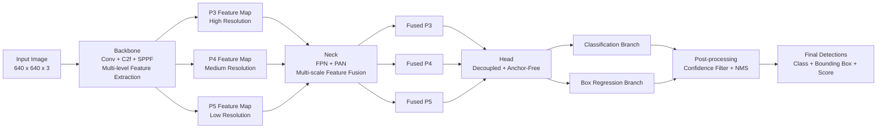
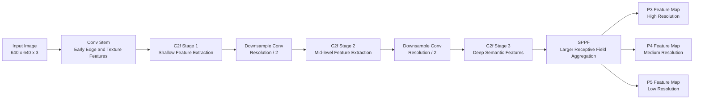
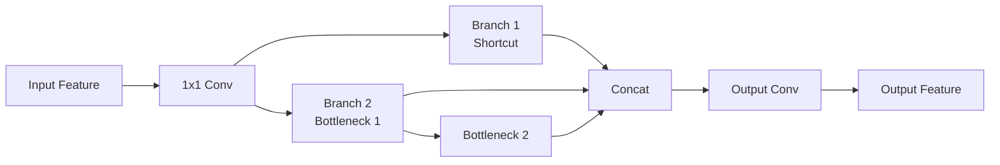
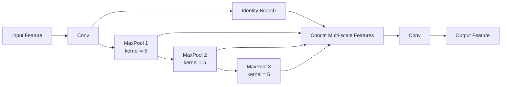

# YOLOv8n 模型架构详细解析

## 1. 文档目的

本文档面向课程小组作业报告撰写，系统性解析 **YOLOv8n (YOLOv8 Nano)** 的模型架构、核心设计思想、训练与推理流程，以及其在本项目“视障人士视觉辅助抓取系统”中的适用性。全文尽量采用“从问题出发、逐层拆解、最后回到项目需求”的逻辑，以保证内容表达清晰、技术论证完整、符合课程报告规范。

---

## 2. 模型概述

YOLOv8 是 Ultralytics 发布的单阶段目标检测模型系列，延续了 YOLO（You Only Look Once）家族“端到端、实时、高效”的核心思路。与两阶段检测器相比，YOLOv8 直接在一张输入图像上完成目标定位与类别识别，不再显式地先生成候选框再进行分类，因此在实时场景中具有明显优势。

YOLOv8 提供多个规模版本，包括 `n`、`s`、`m`、`l`、`x`。其中：

- `YOLOv8n` 表示 **Nano** 版本；
- 它是整个系列中最轻量的模型之一；
- 主要面向边缘设备、CPU 推理、低延迟交互等场景；
- 适合本项目这类需要“摄像头实时采集 + 在线检测 + 即时语音引导”的应用。

从课程项目角度来看，YOLOv8n 并不一定是绝对精度最高的模型，但它在 **检测速度、模型体积、部署成本、工程可实现性** 之间取得了较好的平衡，因此非常适合作为本系统的目标检测主模型。

---

## 3. YOLOv8n 的总体架构

YOLOv8n 的网络结构可以分为三个核心部分：

1. **Backbone（主干网络）**
2. **Neck（特征融合网络）**
3. **Head（检测头）**

这一结构是现代目标检测模型中较为经典的三级流水线：

- Backbone 负责从原始图像中提取不同层次的视觉特征；
- Neck 负责融合高层语义信息和低层细节信息；
- Head 负责输出最终的边界框位置、置信度和类别结果。

如果用功能流来理解，YOLOv8n 的处理过程可以概括为：

`输入图像 -> 多层卷积特征提取 -> 多尺度特征融合 -> 分类/回归预测 -> 后处理输出检测框`

为了更直观地展示 YOLOv8n 的整体结构，下面给出一张简化的模型架构图。该图突出展示了输入图像如何依次经过 Backbone、Neck、Head 与后处理模块，并最终输出检测结果。

图 1 展示了 YOLOv8n 的简化总体架构。其中，Backbone 负责提取多层特征，Neck 负责融合不同尺度的语义信息与细节信息，Head 负责生成分类与定位预测，而后处理模块则进一步筛除冗余检测框，得到最终可用于前端显示和抓取引导的目标检测结果。

这种设计使模型既能理解“物体是什么”，也能判断“物体在哪里”，并兼顾大目标、小目标与复杂背景下的检测表现。

---

## 4. Backbone：主干特征提取网络

### 4.1 Backbone 的作用

Backbone 的任务是将输入图像逐步编码为更具判别性的特征表示。浅层特征通常包含边缘、纹理和局部形状信息；深层特征则包含更强的语义信息，例如“这是杯子”或“这是手机”的抽象概念。

对于抓取辅助任务而言，Backbone 的质量直接决定了模型是否能稳定区分桌面上的常见物体，如 `cup`、`bottle`、`cell phone`、`book` 等。

为了便于理解，可以将 YOLOv8n 的 Backbone 看作一个“逐层压缩空间分辨率、逐层增强语义表达”的特征提取流水线。其简化结构如下图所示：

图 2 表明，Backbone 并不是单一卷积层的堆叠，而是由多级卷积与 C2f 模块共同组成的层级结构。随着网络不断加深，特征图空间尺寸逐步减小，但语义表达能力不断增强，最终为后续的多尺度检测提供稳定输入。

### 4.2 Conv 模块

YOLOv8n 的基础构件首先是卷积模块（Conv Block），通常由以下操作组成：

- 卷积（Convolution）
- 批归一化（Batch Normalization）
- 激活函数（Activation）

该模块的主要作用包括：

- 提取局部空间特征；
- 控制通道数变化；
- 通过步长为 2 的卷积实现下采样；
- 为后续特征融合提供统一的张量表示。

相比传统池化，下采样卷积能让网络在压缩分辨率的同时继续学习有效特征，因此在检测模型中使用更为广泛。

### 4.3 C2f 模块

YOLOv8 相较于早期 YOLOv5 的一个重要改进，是在主干与颈部网络中广泛采用 **C2f 模块**。这是 YOLOv8 架构设计中的关键亮点之一。

#### 4.3.1 C2f 的设计思想

C2f 可以理解为一种改进的 Cross Stage Partial（跨阶段部分连接）结构，其核心目标是：

- 在控制参数量的同时增强特征表达能力；
- 保留更丰富的梯度传播路径；
- 提升训练稳定性与特征复用效率。

从结构上看，C2f 可以理解为“先分流、再逐层提取、最后拼接融合”的模块。其简化示意如下：

图 3 说明，C2f 通过保留部分原始特征分支并串联多个 Bottleneck 结构，使浅层信息与深层语义信息能够共同参与输出。这种设计既降低了信息丢失风险，也增强了梯度传播效率。

#### 4.3.2 C2f 的优势

与更早的 C3 模块相比，C2f 的优势主要体现在：

- **更充分的特征复用**：不同分支中的特征会在后续阶段被重新拼接；
- **更好的梯度流**：反向传播路径更多，有助于浅层和深层参数共同优化；
- **更轻量**：在保持表达能力的前提下，适合 Nano 级别模型部署；
- **更适合实时检测**：对速度和精度的平衡更友好。

对于课程项目而言，这一点非常重要，因为我们不仅需要模型能识别目标，还要求其在普通电脑上维持较低延迟。

### 4.4 SPPF 模块

在主干网络后部，YOLOv8n 还使用了 **SPPF（Spatial Pyramid Pooling - Fast）** 模块。其作用是通过不同感受野的特征聚合，增强模型对不同尺度目标的上下文理解能力。

SPPF 的核心思路是对同一输入特征进行多次池化，再将不同感受野下的结果进行拼接。其简化示意如下：

SPPF 的核心意义在于：

- 扩大有效感受野；
- 在不显著增加计算量的前提下引入更多上下文信息；
- 提升对复杂背景中目标的识别能力。

例如，在桌面抓取场景中，如果 `remote` 周围有书本、杯子或阴影遮挡，仅依赖局部纹理可能不足以完成稳定识别，而 SPPF 有助于模型综合更大区域的信息进行判断。

---

## 5. Neck：多尺度特征融合网络

### 5.1 Neck 的作用

目标检测任务不仅要检测大目标，也要检测中小目标。现实场景中，不同物体在图像中的尺度变化很大。例如：

- 杯子可能占据图像较大区域；
- 手机、遥控器、剪刀等目标可能更小；
- 远近位置变化也会导致同一类别目标出现尺度差异。

因此，仅依赖单层特征图难以兼顾各种尺度。Neck 的作用就是将不同层级的特征进行融合，以提升多尺度检测能力。

### 5.2 FPN + PAN 思想

YOLOv8n 的 Neck 延续了特征金字塔融合思路，整体上可理解为结合了 **FPN（Feature Pyramid Network）** 与 **PAN（Path Aggregation Network）** 的设计理念。

其信息流包括两个方向：

- **自顶向下**：将高层语义特征传递给低层特征图；
- **自底向上**：将低层细节信息再次聚合到高层。

这样做的好处是：

- 深层特征语义强，但空间分辨率较低；
- 浅层特征定位细节强，但语义表达较弱；
- 融合后可以同时兼顾类别识别与位置回归。

### 5.3 多尺度检测的重要性

对于本项目而言，多尺度融合尤其重要，因为桌面场景中存在以下现实问题：

- 目标物体大小差异明显；
- 摄像头与物体距离会变化；
- 手进入画面后可能部分遮挡目标；
- 复杂背景会降低小目标可见性。

Neck 通过融合不同尺度的特征图，提升了系统对 `cell phone`、`remote`、`apple` 等相对较小物体的稳定检测能力，从而改善语音引导阶段的鲁棒性。

---

## 6. Head：检测头设计

### 6.1 检测头的任务

检测头是网络最后输出结果的部分，负责从融合后的特征图中预测：

- 边界框位置；
- 目标是否存在；
- 目标属于哪个类别。

YOLOv8 的检测头设计有两个值得重点说明的特点：

1. **Decoupled Head（解耦头）**
2. **Anchor-Free（无锚框）**

### 6.2 Decoupled Head：分类与回归分离

传统检测头常将类别分类与边界框回归耦合在同一分支中预测，但这两类任务关注的信息并不完全相同：

- 分类更关注语义差异；
- 回归更关注空间位置与几何边界。

YOLOv8 使用解耦头后，会将：

- 分类分支单独建模；
- 边界框回归分支单独建模。

这种设计的优点包括：

- 减少任务冲突；
- 提高收敛效率；
- 改善定位与分类的整体平衡；
- 在训练中通常更稳定。

对于课程项目中的常见抓取目标，这种分离机制可以帮助模型更准确地区分形状相近但类别不同的物体，例如 `bottle` 与 `cup`，同时保持边框定位较为稳定。

### 6.3 Anchor-Free：无锚框机制

YOLOv8 采用 **Anchor-Free** 检测方式，而不是早期 YOLO 中常见的 Anchor-Based 方式。

#### 6.3.1 Anchor-Based 的局限

基于锚框的方法需要预先设定多组先验框（Anchor），模型训练时再学习对这些先验框进行偏移修正。该方式存在一些问题：

- 需要人工设计锚框尺寸；
- 超参数较多；
- 不同数据集往往需要重新聚类锚框；
- 对轻量化部署不够友好。

#### 6.3.2 Anchor-Free 的优势

无锚框设计直接在特征图位置上预测目标位置与尺度，优势包括：

- 结构更简洁；
- 超参数更少；
- 泛化能力更强；
- 更适合工程部署与快速迁移。

对于本项目这类以 COCO 常见类别为主、且强调快速落地的系统，Anchor-Free 能降低训练和调参复杂度，也便于后续将模型拓展到新的抓取类别。

---

## 7. YOLOv8n 的多尺度输出机制

YOLOv8n 通常在多个尺度的特征图上进行预测，以兼顾不同大小目标。可以将其理解为：

- 较高分辨率特征图负责检测小目标；
- 中等分辨率特征图负责检测中等目标；
- 较低分辨率特征图负责检测大目标。

这意味着模型不是只在一个“观察尺度”上完成检测，而是在多个空间分辨率上同时生成预测结果。随后，再通过后处理将不同尺度上的候选框整合为最终输出。

这一机制对辅助抓取任务非常关键，因为：

- 近距离的大杯子与远距离的小杯子都需要识别；
- 手机、遥控器、剪刀等小目标若无高分辨率检测层，容易漏检；
- 多尺度预测能显著增强系统对实际使用环境的适应性。

---

## 8. 训练阶段的核心机制

### 8.1 训练目标

YOLOv8n 在训练阶段并不是简单地“看图猜类别”，而是同时优化多个目标，包括：

- 正确判断目标位置；
- 正确判断边界框大小；
- 正确识别目标类别；
- 尽量减少误检与漏检。

因此，训练过程本质上是一个多任务联合优化问题。

### 8.2 损失函数组成

从报告写作角度，可将 YOLOv8n 的损失函数理解为由以下几部分构成：

- **分类损失（Classification Loss）**：衡量类别预测是否正确；
- **定位损失（Localization / Box Loss）**：衡量预测框与真实框的重合程度；
- **分布式回归相关损失**：用于提高边界框坐标回归的精细程度。

虽然具体实现细节较底层，但从工程角度可以理解为：模型训练时会同时被要求“认对物体”和“框准位置”，而这两件事共同决定了检测性能。

### 8.3 样本分配与正负样本学习

在目标检测训练中，模型并不会把所有位置都当作正样本。YOLOv8 会根据真实框与预测位置的匹配质量进行样本分配，从而让网络重点学习更可能属于目标的区域。

这种策略有助于：

- 提高训练效率；
- 减少背景区域造成的噪声干扰；
- 改善复杂桌面场景中的误检问题。

---

## 9. 推理阶段的工作流程

YOLOv8n 在实际部署时的推理流程可以概括为以下步骤：

### 9.1 输入预处理

摄像头图像首先会被缩放、归一化并转换为模型需要的张量格式。这样做的目的是：

- 保证输入尺寸统一；
- 提高批处理和推理效率；
- 让模型在训练与推理阶段保持数据分布一致。

### 9.2 前向传播

图像进入 Backbone、Neck 与 Head 后，模型会在多个尺度上生成候选预测框及对应类别分数。

### 9.3 置信度筛选

模型会剔除低置信度预测，只保留更可信的检测结果。这一步可以减少无效框，提高前端显示和后续逻辑判断的稳定性。

### 9.4 非极大值抑制（NMS）

同一个目标常常会对应多个重叠候选框。NMS 的作用是：

- 保留得分最高的框；
- 删除与其高度重叠的冗余框；
- 输出更简洁、更稳定的最终结果。

在辅助抓取系统中，NMS 很重要，因为如果同一物体同时出现多个框，后续“目标中心点计算”和“方向引导”就会出现抖动，影响用户体验。

---

## 10. YOLOv8n 与本项目的适配性分析

### 10.1 为什么选择 YOLOv8n 而不是更大的模型

在本项目中，目标检测模型不仅要“检测得到”，还要“检测得足够快”。系统整体链路包括：

- 浏览器采集摄像头画面；
- WebSocket 向后端发送图像；
- 后端执行 YOLOv8n 检测与手部分析；
- 计算手与目标的空间关系；
- 将结果回传前端并触发语音引导。

如果检测模型过大，将会直接带来以下问题：

- 帧率下降；
- 语音提示滞后；
- 用户动作与系统提示不同步；
- 抓取成功率下降。

因此，本项目优先选择 YOLOv8n，而不是更重的 `s/m/l/x` 版本，其核心原因是 **系统实时性优先于极限检测精度**。

### 10.2 YOLOv8n 对本项目的具体优势

- **轻量化**：模型更小，更容易在普通开发环境中运行；
- **低延迟**：更适合实时抓取引导；
- **工程部署简单**：Ultralytics 接口使用方便，训练与推理流程统一；
- **支持 COCO 预训练**：可以直接利用现成权重识别常见日用品；
- **迁移能力较好**：后续如需针对特定抓取场景微调，工程成本较低。

### 10.3 与任务需求的对应关系

本系统需要识别的目标大多是日常抓取物体，例如：

- `cup`
- `bottle`
- `bowl`
- `apple`
- `banana`
- `cell phone`
- `book`
- `remote`
- `scissors`

这些类别本身就存在于 COCO 数据集中，因此 YOLOv8n 的预训练权重可以直接提供较好的初始识别能力。这对课程项目非常有利，因为它减少了从零训练大模型的时间成本，使小组可以把更多精力放在“检测结果如何转化为抓取引导”这一更具创新性的系统设计上。

---

## 11. YOLOv8n 在本项目中的局限性

虽然 YOLOv8n 非常适合实时系统，但它并非没有缺点。为了符合课程报告规范，除了阐述优点，也应对模型局限性进行客观分析。

### 11.1 小目标与遮挡问题

在桌面场景中，如果目标很小、被手遮挡，或与背景颜色接近，YOLOv8n 可能出现：

- 漏检；
- 检测框抖动；
- 类别混淆。

### 11.2 极端光照条件下性能下降

如果环境过暗、逆光明显或有强反光，图像质量会下降，进而影响特征提取效果，导致检测稳定性降低。

### 11.3 Nano 版本精度上限有限

由于 YOLOv8n 是轻量化模型，其参数规模和表达能力相对有限。在复杂场景下，整体精度通常不及更大的 YOLOv8m、YOLOv8l 或 YOLOv8x。

### 11.4 单帧检测缺乏时序一致性

YOLOv8n 本质上是逐帧检测模型，并不天然建模视频时序关系。因此在连续帧中，检测框中心可能出现轻微抖动，这会进一步影响抓取方向提示的稳定性。

这一问题可在未来工作中通过以下方式缓解：

- 引入目标跟踪算法；
- 对中心点做时序平滑；
- 使用多帧融合或卡尔曼滤波。

---

## 12. 可写入课程报告的总结表述

在课程小组作业报告中，可以将 YOLOv8n 的架构总结为以下表述：

> YOLOv8n 是一种轻量级单阶段目标检测模型，整体由 Backbone、Neck 和 Head 三部分组成。其 Backbone 使用 C2f 模块增强特征提取与梯度传播能力，Neck 采用多尺度特征融合机制提升对不同尺寸目标的检测效果，Head 则通过解耦头和无锚框设计提高分类与定位效率。相较于更重的模型版本，YOLOv8n 在保持较好检测性能的同时具有更低的计算开销，因此特别适用于需要实时视觉反馈的辅助抓取系统。

如果需要进一步扩写，也可以补充如下论述：

> 在本项目中，YOLOv8n 的选择体现了“系统级优化”而非单纯追求检测精度的思路。由于系统最终目标不是离线评测，而是为视障用户提供低延迟、可操作的实时抓取引导，因此模型的轻量化、高响应性和部署便利性比极限精度更重要。YOLOv8n 恰好满足了这一设计要求。

---

## 13. 结论

综合来看，YOLOv8n 的核心优势并不仅仅在于“它是一个能检测物体的模型”，而在于它通过 **轻量化 Backbone、多尺度特征融合 Neck、解耦且无锚框的检测头**，构建了一套适合实时部署的完整检测框架。

对于本课程项目而言，YOLOv8n 的价值主要体现在三个方面：

- 它能够利用 COCO 预训练权重快速识别常见抓取目标；
- 它具有较低推理开销，适合实时语音引导系统；
- 它在工程实现、系统联调与课程展示中具有较高可行性。

因此，将 YOLOv8n 作为本项目的目标检测核心模块，是一个兼顾理论合理性与工程可行性的选择。
